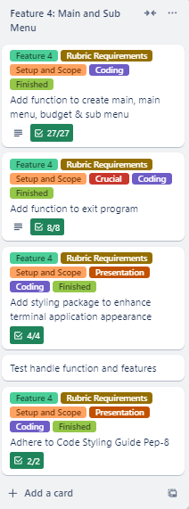
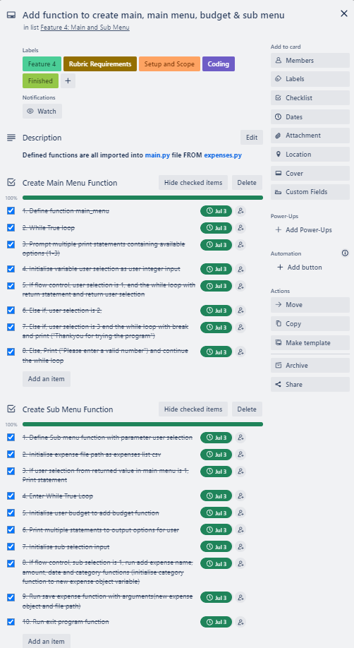
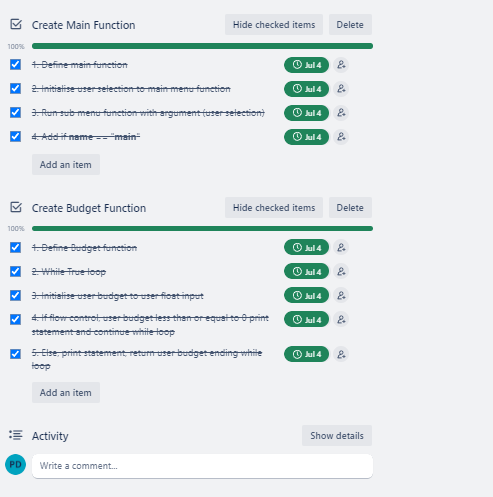
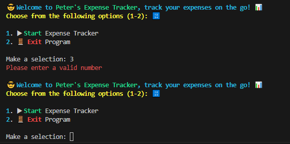
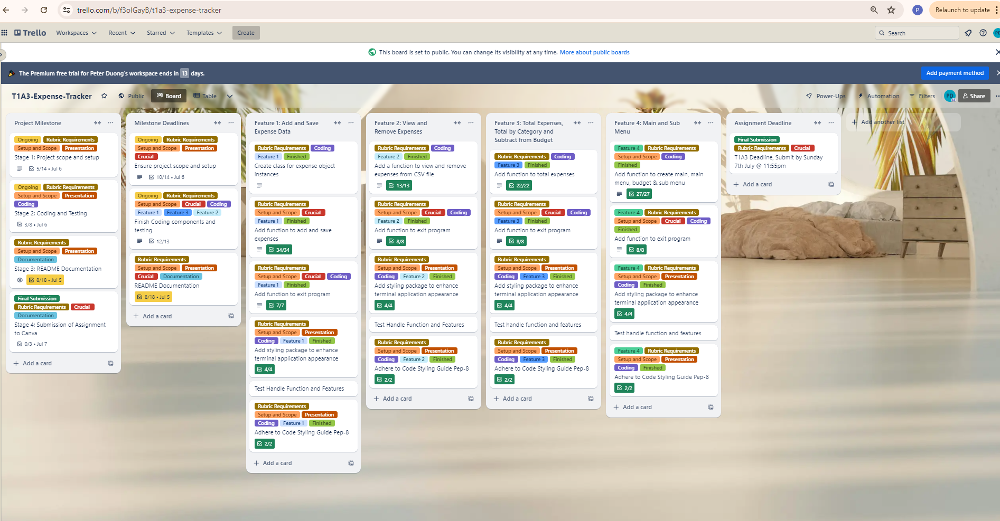
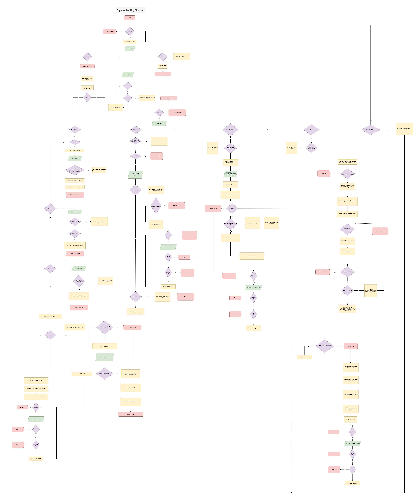

# Expense Tracker

## Link to Source Control Repository & Screenshot
[GitHub-Repository](https://github.com/peter-duongGHub?tab=repositories)
### Screenshot of provided link: 


## Help Documentation - Steps, Dependencies, System/Hardware Requirements, Command Line Arguments for application
This help documentation will include a comprehensive guide on how to run Peter's Expense Tracker on Windows, Linux and Mac.

### System/Hardware Requirements - Running a Python Terminal Application  
> All system/hardware requirements listed below are for the  purposes of this Expense Tracking application. Depending on the complexity of an application, a better CPU or greater amount of RAM, storage and graphics may be required.  

**1. Operating System**  
Users may use one of the following operating systems:
- Windows 
- macOS
- Linux

**2. Processor (CPU)**  
Any modern CPU that contains any 1 of the 3 Operating systems mentioned will suffice.

**3. Memory (RAM)**  
There is a minimum of 8GB of ram recommended for this terminal application. https://medium.com/@Developernetworks/how-much-ram-do-i-need-for-code-a-comprehensive-guide-bcf01a26b4f2

**4. Storage**
There is a minimum of 2GB of storage recommended for this terminal application. This storage space will include:
- Python Installation
- Dependencies 
- Virtual environment
- Expense Tracker Application Source Code
- File created to store expenses
- Any other files etc.

**5. Graphics**
For this terminal application any graphics hardware supporting 1 of the 3 operating systems will be sufficient.

**5. Internet Connection**
To install the necessary dependencies, python such as Python packages, libraries etc an internet connection will be required. An internet connection will also be needed to install Python, Pip, A text editor such as Visual Studio Code/PyCharm and to obtain the application source code from Canva.


### Step 1 - Python Installation  
**Python**     
Users must have Python installed on their devices to run the Expense Tracking Application. Alternatively windows users that do not have python installed may use py2exe which will package the python script into an executable. Py2exe will contain the correct modules and python interpreter to help run the script.

Users must first download Python on their operating system. It is recommended to download Python version 3.6 or greater. The download for Linux, Windows and Mac may be found here. Please follow the instructions provided in the web link to have Python installed.
[Python-Download](https://www.python.org/downloads/)


### Step 2 - Text Editor or IDE
Users must then download a text editor such as Visual Studio Code or IDE such as PyCharm to run the terminal application. Links of both Visual Studio Code and PyCharm are listed below.  Please follow the instructions provided in the web link to have a text editor or IDE installed.

[Visual-Studio-Code](https://code.visualstudio.com/download)


[PyCharm](https://www.jetbrains.com/pycharm/download/?section=windows)


### Step 3 - Installation of Pip
Users must check if they have Pip installed. Installation of pip will be necessary to help with installation of dependencies for this application. A link to installing pip is provided below.  
[Pip-Install](https://pip.pypa.io/en/stable/installation/)


### Step 4.1 - Extract Zip File & Running the Application
Users must download Peter's Expense Tracker Terminal Application zip file and have the file extracted to use the terminal application. The Expense tracking application source code file will be located in {PeterDuong}_T1A3 directory and can be run with the following methods using a terminal such as Ubuntu:

1. Change directory into project directory folder ({PeterDuong}_T1A3)

``` cd {PeterDuong}_T1A3 ```

2. Change directory into source code folder (named 'src')

``` cd src ```

3. Create a virtual environment (see steps provided below in 4.2)

4. Install dependencies (requirements.txt)
The requirements.txt file will include the following dependencies for installation:
- rich
- 
- 
- 

``` pip install -r requirements.txt ```

5. Next you may run the Expense tracking application using:

``` python3 main.py ```

ALTERNATIVELY, users may use the method below to automate the process to automatically check dependencies, python installation, pip installation, virtual environment, and running of the application without needing to type much. This method involves running a shell executable file with a sophisticated script to automate the process of running the application.

1. Change directory into project directory folder ({PeterDuong}_T1A3)

``` cd {PeterDuong}_T1A3 ```

2. Change directory into source code folder (named 'src')

``` cd src ```

3. Run executable expense_tracker.sh file

``` ./expense_tracker.sh ```

Disclaimer: This is a very brief guide on running the application. Different factors such as current working directory may affect whether you can initially change directory in the project directory folder. For more information on common terminal commands please visit:

Common Terminal Commands link:
https://gist.github.com/bradtraversy/cc180de0edee05075a6139e42d5f28ce

Common Terminal Commands Screeshot:


### Step 4.2 - Virtual Environment 
Users should ensure they are working in a virtual environment, to help create an isolated environment ensuring this application has its own dependencies and any dependencies installed do not affect any other potential python projects the users may be related to.

After pip has been installed:

Inside a terminal application such as Ubuntu, the following scripts may be applied to create a virtual environment:

1. Install Virtualenv  
``` pip install virtualenv ```

2. Change Directory to project folder 

``` cd {PeterDuong}_T1A3 ```

3. Change Directory to src folder

``` cd src ```

4. Create virtual environment - venv  

``` python<version> -m venv venv ```

5. Activate virtual environment 

``` source venv/bin/activate ```

Disclaimer: This is a very brief installation guide on creating and activating a Virtual Environment. Users may need to check the current directory they are in and navigate correctly to the project directory folder. These steps are meant for macOS and linux users. For further information please visit:

For windows:  
https://docs.python.org/3/library/venv.html

## List of Features (at least three) & Implementation Plan

### Feature 1 TrelloBoard - Add & Save Expenses (Checklist of tasks for feature 1)


### Feature 1 TrellBoard Checklist Items - Add & Save Expenses 


### Feature 2 TrelloBoard - View and Remove Expenses (Checklist of tasks for feature 1)


### Feature 2 TrelloBoard Checklist Items - View and Remove Expenses


### Feature 3 TrelloBoard - Total Expenses, Total By Category & Subtract from Budget (Checklist of tasks for feature 1)


### Feature 3 TrelloBoard Checklist Items - Total Expenses, Total By Category & Subtract from Budget


### Feature 4 TrelloBoard - Main Menu, Sub Menu & Budget (Checklist of tasks for feature 4)


### Feature 4 TrelloBoard Checklist Items - Main Menu, Sub Menu & Budget 




## How to use the Expense Tracking application
> Users type out using only letters and numbers where specified. Any other characters listed outside letters and numbers where appropriate will output an error and reprompt users. 

### Main Menu Terminal
  
When starting up the Terminal Application users will see a main menu screen introducing users to the terminal application and asking users to select between two options (1 - 2).
1. Start Expense Tracker
2. Exit Program

If users select '1. Start Expense Tracker' a terminal output "Starting your Expense Tracking Journey..." will appear followed by another user prompt (explained in 'User Budget Input').


If users select '2. Exit Program' the terminal application will end leaving a terminal output "Thankyou for trying out Peter's Expense Tracker, till next time!".


User input must be in the form of a number restricting between 1 and 2 (select either 1 or 2). Any characters, letters, numbers etc typed other than the integers 1 and 2 will result in an error terminal output "Please enter a valid number" followed by a reprompt of the main menu asking for a user selection.



### User Budget Input
After selecting option 1 

take users to a second sub menu page where they will be prompted with a list of 


### Users may add expenses
- Users may input expenses including expense name, amount, date, location & category. These expenses will be saved to a CSV file
### How Users will add expenses
Users will first be prompted at the main menu to select 1 of 3 options. 
- Execute Peter's Expense tracking application
Selecting 1. to execute the application program will send users to a sub menu where users will be prompted to choose from options 1 to 5. 
1. Add & Save Expenses to a CSV File

After selecting Option 1 within the sub menu, users will be made to enter a while loop with condition "True". 


2. View Expenses
3. Remove a Specific Expense from a CSV File
4. Total Expenses, Total based on Category and Subtraction of Expenses from User Input Budget
5. Return to Main Menu
  

- View Instructions on how to operate Peter's Expense tracking application
- Exit the Program


be included in a while loop condition after selecting option  
"1. Add & Save expense to CSV file"


### Describe Adding Expenses providing a walkthrough of the logic of the application
- 

### Users may view expenses
- Users may view a list of expenses listed in a CSV file

### Describe Viewing Expenses providing a walkthrough of the logic of the application

### Users may remove expenses
- Users may remove a specific expense from a list of expenses in a CSV file

### Describe Removing Expenses providing a walkthrough of the logic of the application

### Users may total expenses
- Users may total expenses based on a list of expenses in a CSV file
- Users may total expenses based on the category of each expense and displayed as an output

### Describe Totaling Expenses providing a walkthrough of the logic of the application

### Users input a budget
- Users may input a budget
- Users may subtract total expenses from their entered budget

### Describe Adding Expenses providing a walkthrough of the logic of the application


## Ensured understanding of 
### Variables and scope (use of and understanding)
- Screenshots

### Loops and conditional control structures
- Screenshots

### Error handling
- Screenshots

## Visual Details of Python program flow - FlowChart


## Textual Details of Python program flow - PseudoCode

## Implementation Plan (Project management platform to track this plan - Trello)
### Outline each feature implementation and checklist of tasks for each feature
[TrelloBoard-Feature1](./docs/Trello_Feature1.PNG)
[TrelloBoard-Feature2](./docs/Trello_Feature1.PNG)
[TrelloBoard-Feature3](./docs/Trello_Feature1.PNG)
[TrelloBoard-Feature4](./docs/Trello_Feature1.PNG)


### Prioritise implementation of different features, checklist items within a feature

### Provide deadline, duration or time indicator for each feature or checklist/checklist-item


## Help Documentation (Extensive run down and system requirements)
-  includes a set of instructions which accurately describe how to use and install the application.
- steps to install the application
- any dependencies required by the application to operate
- any system/hardware requirements
- how to use any command line arguments made for the application


## Trello
### Link to Trello 
[TrelloBoard-Link](https://trello.com/b/f3oIGayB/t1a3-expense-tracker)

### Screenshot of Trello (Project Management Platform) - Track Implementation Plan


## Algorithms
### Visual Representation


### Textual Representation

## Python Styling Guide
My chosen styling guide is PEP 8 – Style Guide for Python Code(van Rossum, Warsaw and Coghlan, 2001). My terminal application will adhere to PEP 8, a commonly used styling guide within Python (GeeksforGeeks, 2020). I have an installed autopep8 package to have my code adhere to PEP 8 Styling guide standards consistently throughout my application.

### Screenshot of AutoPEP8 Used for Expense Tracking Application all files.


The chosen styling guide may be found at: [PEP8](https://peps.python.org/pep-0008/).  
### Screenshot of provided link: 


## References
- van Rossum, G., Warsaw, B. and Coghlan, N. (2001). PEP 8 – Style Guide for Python Code. [online] peps.python.org. Available at: https://peps.python.org/pep-0008/.
- GeeksforGeeks. (2020). Python - Conventions and PEP8. [online] Available at: https://www.geeksforgeeks.org/python-conventions-and-pep8/.