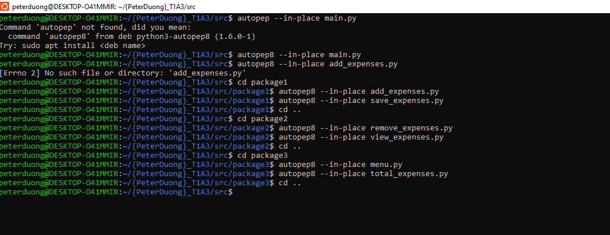

# Expense Tracker

## Link to Source Control Repository & Screenshot
[GitHub-Repository](https://github.com/peter-duongGHub?tab=repositories)
### Screenshot of provided link: 


## Help Documentation - Steps, Dependencies, System/Hardware Requirements, Command Line Arguments for application
This help documentation will include a comprehensive guide on how to run Peter's Expense Tracker on Windows, Linux and Mac.

### Step 1 - Python Installation
Users must first download Python on their operating system. It is recommended to download Python version 3.6 or greater. The download for Linux, Windows and Mac may be found here. 
[Python-Download](https://www.python.org/downloads/)


### Step 2 - Text Editor or IDE
Users must then download a text editor such as Visual Studio Code or IDE such as PyCharm to run the terminal application. Links of both Visual Studio Code and PyCharm are listed below. 

[Visual-Studio-Code](https://code.visualstudio.com/download)


[PyCharm](https://www.jetbrains.com/pycharm/download/?section=windows)


### Step 3 - Installation of Pip
Users must check if they have Pip installed. A link to installing pip is provided below.  
[Pip-Install](https://pip.pypa.io/en/stable/installation/)


### Step 4 - Extract Zip File
Users must download Peter's Expense Tracker Terminal Application zip file and have the file extracted to use the terminal application.


Required packages that have been installed for my python terminal application will be located in a file named requirements.txt. This will include:
- rich
- pyinstaller
- pytest

## Expense Tracker
- To use the terminal application users must change directory to src directory. Within Ubuntu for Windows or for linux, typing the below snippet will help direct users to the correct directory for execution of the application.     
```cd src``` 

- To automate the process, an executable .sh file has been created to help users install required dependencies, software automate the terminal application. The executable script is run by typing the below inside a terminal application. 
```./expense_tracker_script.sh```

## List of Features (at least three) & Implementation Plan

### Feature 1 TrelloBoard - Add & Save Expenses (Checklist of tasks for feature 1)


### Feature 1 TrellBoard Checklist Items - Add & Save Expenses 


### Feature 2 TrelloBoard - View and Remove Expenses (Checklist of tasks for feature 1)


### Feature 2 TrelloBoard Checklist Items - View and Remove Expenses


### Feature 3 TrelloBoard - Total Expenses, Total By Category & Subtract from Budget (Checklist of tasks for feature 1)


### Feature 3 TrelloBoard Checklist Items - Total Expenses, Total By Category & Subtract from Budget


### Feature 4 TrelloBoard - Main Menu, Sub Menu & Budget (Checklist of tasks for feature 4)


### Feature 4 TrelloBoard Checklist Items - Main Menu, Sub Menu & Budget 


### Main Menu Terminal
  
When starting up the Terminal Application users will see a main menu screen introducing users to the terminal application and asking users to select between two options (1 - 2).
1. Start Expense Tracker
2. Exit Program

### User Budget Input
Selecting Option "1. Start Expense Tracker" will:
1. Prompt users for a budget input 

take users to a second sub menu page where they will be prompted with a list of 


### Users may add expenses
- Users may input expenses including expense name, amount, date, location & category. These expenses will be saved to a CSV file
### How Users will add expenses
Users will first be prompted at the main menu to select 1 of 3 options. 
- Execute Peter's Expense tracking application
Selecting 1. to execute the application program will send users to a sub menu where users will be prompted to choose from options 1 to 5. 
1. Add & Save Expenses to a CSV File

After selecting Option 1 within the sub menu, users will be made to enter a while loop with condition "True". 


2. View Expenses
3. Remove a Specific Expense from a CSV File
4. Total Expenses, Total based on Category and Subtraction of Expenses from User Input Budget
5. Return to Main Menu
  

- View Instructions on how to operate Peter's Expense tracking application
- Exit the Program


be included in a while loop condition after selecting option  
"1. Add & Save expense to CSV file"


### Describe Adding Expenses providing a walkthrough of the logic of the application
- 

### Users may view expenses
- Users may view a list of expenses listed in a CSV file

### Describe Viewing Expenses providing a walkthrough of the logic of the application

### Users may remove expenses
- Users may remove a specific expense from a list of expenses in a CSV file

### Describe Removing Expenses providing a walkthrough of the logic of the application

### Users may total expenses
- Users may total expenses based on a list of expenses in a CSV file
- Users may total expenses based on the category of each expense and displayed as an output

### Describe Totaling Expenses providing a walkthrough of the logic of the application

### Users input a budget
- Users may input a budget
- Users may subtract total expenses from their entered budget

### Describe Adding Expenses providing a walkthrough of the logic of the application


## Ensured understanding of 
### Variables and scope (use of and understanding)
- Screenshots

### Loops and conditional control structures
- Screenshots

### Error handling
- Screenshots

## Visual Details of Python program flow - FlowChart


## Textual Details of Python program flow - PseudoCode

## Implementation Plan (Project management platform to track this plan - Trello)
### Outline each feature implementation and checklist of tasks for each feature
[TrelloBoard-Feature1](./docs/Trello_Feature1.PNG)
[TrelloBoard-Feature2](./docs/Trello_Feature1.PNG)
[TrelloBoard-Feature3](./docs/Trello_Feature1.PNG)
[TrelloBoard-Feature4](./docs/Trello_Feature1.PNG)


### Prioritise implementation of different features, checklist items within a feature

### Provide deadline, duration or time indicator for each feature or checklist/checklist-item


## Help Documentation (Extensive run down and system requirements)
-  includes a set of instructions which accurately describe how to use and install the application.
- steps to install the application
- any dependencies required by the application to operate
- any system/hardware requirements
- how to use any command line arguments made for the application


## Trello
### Link to Trello 
[TrelloBoard-Link](https://trello.com/b/f3oIGayB/t1a3-expense-tracker)

### Screenshot of Trello (Project Management Platform) - Track Implementation Plan


## Algorithms
### Visual Representation


### Textual Representation

## Python Styling Guide
My chosen styling guide is PEP 8 – Style Guide for Python Code(van Rossum, Warsaw and Coghlan, 2001). My terminal application will adhere to PEP 8, a commonly used styling guide within Python (GeeksforGeeks, 2020). I have an installed autopep8 package to have my code adhere to PEP 8 Styling guide standards consistently throughout my application.

### Screenshot of AutoPEP8 Used for Expense Tracking Application all files.


The chosen styling guide may be found at: [PEP8](https://peps.python.org/pep-0008/).  
### Screenshot of provided link: 


## References
- van Rossum, G., Warsaw, B. and Coghlan, N. (2001). PEP 8 – Style Guide for Python Code. [online] peps.python.org. Available at: https://peps.python.org/pep-0008/.
- GeeksforGeeks. (2020). Python - Conventions and PEP8. [online] Available at: https://www.geeksforgeeks.org/python-conventions-and-pep8/.