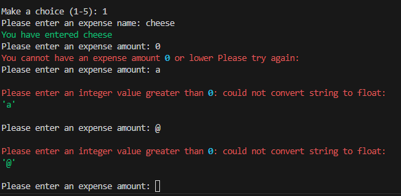
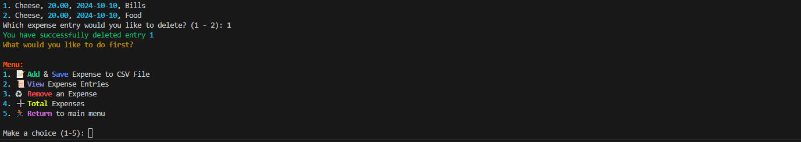
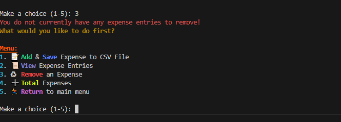
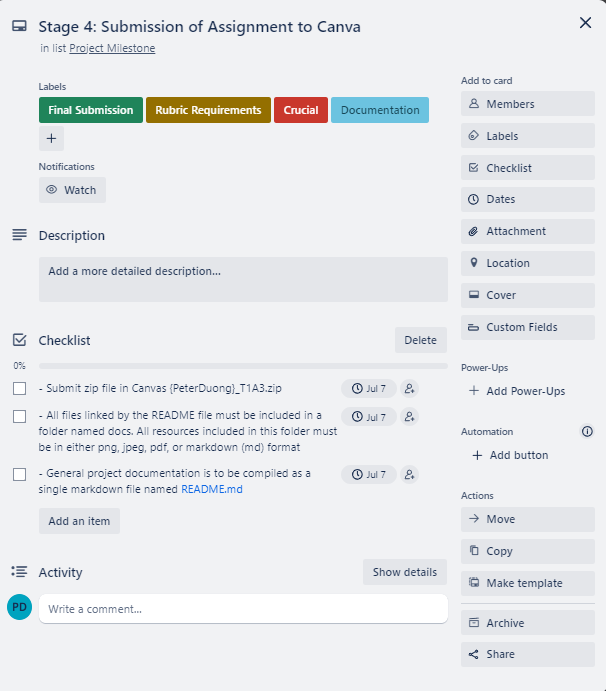

# Expense Tracker - Peter Duong T1A3

## Link to Source Control Repository & Screenshot
[GitHub-Repository](https://github.com/peter-duongGHub?tab=repositories)
### Screenshot of provided link: 


## Help Documentation - Steps, Dependencies, System/Hardware Requirements, Command Line Arguments for application  
This help documentation will include a comprehensive guide on how to run Peter's Expense Tracker on Linux and Mac.

### System/Hardware Requirements - Running a Python Terminal Application    
> All system/hardware requirements listed below are for the  purposes of this Expense Tracking application. Depending on the complexity of an application, a better CPU or greater amount of RAM, storage and graphics may be required.  

**1. Operating System**    
Users may use one of the following operating systems:
- Windows 
- macOS
- Linux

**2. Processor (CPU)**    
Any modern CPU that contains any 1 of the 3 Operating systems mentioned will suffice.

**3. Memory (RAM)**      
There is a minimum of 8GB of ram recommended for this terminal 
application(Developer Networks, 2023).

**4. Storage**    
There is a minimum of 2GB of storage recommended for this terminal application. This storage space will include:
- Python Installation
- Dependencies 
- Virtual environment
- Expense Tracker Application Source Code
- CSV File created to store expenses

**5. Graphics**      
For this terminal application any graphics hardware supporting 1 of the 3 mentioned operating systems will be sufficient.

**6. Internet Connection**      
To install python, pip, necessary dependencies such as Python packages, libraries etc an internet connection will be required. An internet connection will also be required to install a text editor such as Visual Studio Code, IDE such as PyCharm or Terminal such as Ubuntu and to obtain the application source code from Canva or GitHub.

### Dependencies
The following dependencies will be required to ensure the application runs smoothly and as intended for the user.
- rich

### Installation Steps - Running a Python Terminal Application   
#### Step 1 - [Python Installation](https://www.python.org/downloads/)         
**Python**       
Users must have Python installed on their devices to run the Expense Tracking Application. Alternatively windows users that do not have python installed may use py2exe which will package the python script into an executable. Py2exe will contain the correct modules and python interpreter to help run the script.  

Users must first download Python on their operating system. It is recommended to download Python version 3.6 or greater. The download for Linux, Windows and Mac may be found by click "Python Installation". Please follow the instructions provided in the web link to have Python installed.    
 

Alternatively here are the scripts to downloading python for linux and macOS users.

##### 1.1 For Linux(Ubuntu):  
**1.1a Open a terminal**  

**1.1b Verify Installation (if not already installed)**    

```
python3 --version
```

**1.1c Install Python 3.6**    

```
sudo apt-get update
sudo apt-get install python3.6
```

##### 1.2 For MacOs:     
**1.2a Open a terminal**

**1.2b Check if Homebrew Installed**  

```
brew --version
```

**1.2c Install Homebrew if not installed**   

```
/bin/bash -c "$(curl -fsSL https://raw.githubusercontent.com/Homebrew/install/master/install.sh)"
```

**1.2d Install Python**   
```
brew install python
```

#### Step 2 - [Text Editor](https://code.visualstudio.com/download), [IDE](https://www.jetbrains.com/pycharm/download/?section=windows) or [Terminal](https://ubuntu.com/download)      
If users do not currently already have one, they must then download a text editor such as Visual Studio Code, IDE such as PyCharm or Terminal (such as Ubuntu) to run the terminal application. Links of both Visual Studio Code, PyCharm and Ubuntu are listed below.  Please follow the instructions provided in the web link to have a text editor or IDE installed.   

  

  


#### Step 3 - [Installation of Pip](https://pip.pypa.io/en/stable/installation/) 
Users must check if they have Pip installed. Installation of pip will be necessary to help with installation of dependencies for this application. A screenshot to installing pip web page is provided below. Users may click "Installation of Pip" to direct themselves to a webpage including instructions to install pip.
  

Alternatively here are the scripts to downloading pip.

##### 3.1 For Linux:
**3.1a Open a terminal**

**3.1b Updates packages**
```
sudo apt update
```

**3.1c Install Pip for Python3**
```
sudo apt install python3-pip
```

**3.1d Verify Installation**
```
pip3 --version
```

##### 3.2 For MacOS:

**3.2a Open a terminal**

**3.2b Install pip if not already installed**
```
python3 -m ensurepip
```

**3.2c Verify installation**
```
pip3 --version
```

#### Step 4 - Extract Zip File, Obtain from Repository & Running the Application  
Users can either download Peter's Expense Tracker Terminal Application zip file and have the file extracted (from Canva) or get the source code from [GitHub](#link-to-source-control-repository--screenshot) through cloning, explained in [section 4.2](#41-cloning-repository-method) to use the terminal application. The Expense tracking application source code file will be located in {PeterDuong}_T1A3 directory and can be run with the following methods using a terminal such as Ubuntu. 
Ensure you have followed the necessary steps [above](#step-1---python-installation) first.

#### 4.1 Extract Zip File Method
**4.1a Open a terminal**  

**4.1b Check current working directory**    

```
pwd
```

**4.1c Navigate into project directory folder ({PeterDuong}_T1A3) by changing directory**      

``` 
cd {PeterDuong}_T1A3
```  

**4.1d Change directory into source code folder (named 'src')**    
This will contain all the necessary code, packages, dependencies (inside requirements.txt), executables (.sh file).  

``` 
cd src 
```  

#### 4.1 Cloning Repository Method
**4.2a Go to [Peter's Github](#link-to-source-control-repository--screenshot)**  

**4.2b Getting the repository onto your computer**  
On Peter's Expense Tracker repository click "Code" and copy git@github.com:peter-duongGHub/t1a3-expense-tracker.git  


**4.2c Open a terminal**  

**4.2d Navigate to a directory where you could like the cloned directory to be placed**  

**4.2e Clone the repository**  

```
git clone git@github.com:peter-duongGHub/t1a3-expense-tracker.git
``` 

**4.2f Press Enter**  
Press Enter to clone the repository

**4.2g Change directory into source folder**  
```
cd src
```

**Step 5 - Create a virtual environment**    
Users should ensure they are working in a virtual environment to help create an isolated environment ensuring this application has its own dependencies and any dependencies installed do not affect any other potential python projects the users may be related to or viewing.  

##### 5.1 For Linux:  

**5.1a Open a terminal**  

**5.1b Install Virtualenv (may need to input sudo in front of pip)**        
``` 
pip install virtualenv
```  

**5.1c Create virtual environment - <venv_name> may be replaced with the name of the virtual environment you would like to create**     

``` 
python3 -m venv <venv_name>
```  

**5.1d Activate virtual environment**     

``` 
source venv/bin/activate 
```  

**5.1e Deactivating virtual environment when finished utilising**

```
deactivate
```

##### 5.2 For MacOs:

**5.2a Open a terminal**    


**5.2b Install virtualenv**    
```
sudo pip install virtualenv
```

**5.2c Create new virtual environment**  
```
virtualenv venv
```

**5.2d Activate virtualenv**    
```
source venv/bin/activate
```

**5.2e Deactivate virtualenv when finished utilising**  
```
deactivate
```

**4 & 5 Disclaimer**: This is a very brief installation guide on creating and activating a Virtual Environment. Users may need to check the current directory they are in and navigate correctly to the project directory folder. 
These steps are meant for macOS and linux users, this may vary for windows users. 

Common Terminal Commands link:  
https://gist.github.com/bradtraversy/cc180de0edee05075a6139e42d5f28ce  

Common Terminal Commands Screeshot:  
  
 
**Step 6.1 - Install dependencies (requirements.txt)**     
The requirements.txt file will include the following dependencies for installation:  
- rich

**6.1a Install dependencies from file requirements.txt**

``` 
pip install -r requirements.txt 
```  

**6.1b Running Expense Tracking Application**

``` 
python3 main.py 
```  

ALTERNATIVELY, users may use the method below to automate the process to automatically check dependencies, python installation, pip installation, virtual environment, and running of the application without needing to type much. This method involves running a shell executable file with a sophisticated script to automate the process of running the application.  

**Step 6.2 Alternative executable script file (expense_tracker.sh)**  

**6.2a Run executable expense_tracker.sh file**   
This step is recommended after all steps from 1 - 5 have been applied.   
Running this executable file will run scripts to automate the process of running the Expense Tracking application. If one of the specific below steps are not already installed 
or implemented on your device (Created Virtual Environment) the executable script will not execute the rest of the executable, in turn not run the application.  
It will NOT:
- Install Python, it will provide a terminal output if python is not installed: "You do not currently have Python3 installed. Please install Python3 and run the script again"
- Install Pip, it will provide a terminal output if pip is not installed: "You current do not have pip installed please install pip."
- Create a Virtual Environment, it will provide a terminal output if one doesnt exist: "There is an error: Virtual environment does not exist. Please setup a virtual environment by inputing 'python3 -m venv venv' and retry." and **exit** the script.

It will:
- Verify if Python is installed, if so the script will provide a terminal output "You currently have Python3 installed."
- Verify if Pip is installed, if so the script will provide a terminal output "You current have pip installed."
- Verify if a Virtual Environment exists, if so the script will provide a terminal output "Virtual environment exists"
- Activate the virtual environment
- Install required dependencies
- Echo a success message if everything goes well "Environment setup complete. Virtual environment activated."
- Run the Expense Tracking application
- Deactivate the virtual environment when user completes use of application

``` 
./expense_tracker.sh 
```  

## List of Features (at least three) & Description (Conditions, Potential Errors, Steps & Guide)

### Algorithm (Visual Walkthrough of logic)  
  

### Overview of Expense Tracker (Purpose & Features)  
> Users type out using only specific letters and numbers where asked. Any other characters listed outside letters and numbers where appropriate will output an error and reprompt users.     

The purpose of Peter's Expense Tracking terminal application is to allow users to quickly and efficiently add, view, remove & total their expenses against a fixed budget implemented by the user. It is a useful application to help users keep track of certain expenses they may have in their lives and provides a swift approach to calculating, categorising and viewing these expenses.   

**This application will include the following four features:**
1. Add & Save Expenses to a CSV File
2. View and Remove Expenses from a CSV File
3. Total Expenses, Total by Category and Subtract from Budget (from a CSV File)


### Error Handling 
### Main Menu Terminal  
    
When starting up the Terminal Application users will see a main menu screen introducing users to the terminal application and asking users to select between two options (1 - 2).   
1. Start Expense Tracker  
2. Exit Program  

If users select '1. Start Expense Tracker' a terminal output "Starting your Expense Tracking Journey..." will appear followed by another user prompt (explained in 'User Budget Input').  

  

If users select '2. Exit Program' the terminal application will end leaving a terminal output "Thankyou for trying out Peter's Expense Tracker, till next time!".  

  


**Conditions and Error Handling**  
User input must be in the form of a number restricted between 1 and 2 (select either 1 or 2). Any characters, letters, numbers etc typed other than the integers 1 and 2 will result in an error terminal output "Please enter a valid number (1 or 2)" followed by a reprompt of the main menu asking for a user selection.  

 
 
   
#### User Budget Input  
After selecting option 1 in the main menu  users must enter a budget. 

**Conditions and Error Handling**  
The budget entered must only numbers and may include numbers to a decimal place. Numbers greater than 2 decimal places (Example: 2.345) will be rounded to the nearest tenth. The application only requires 1 user input budget, any subsequent budget inputs will override previous budget inputs. Budgets will not be added, subtracted or operated on with other subsequent user budget inputs.  

  

Budgets entered that are less than or equal to 0 will result in a terminal output "Please enter a valid number" followed by a reprompt of the users budget.  

  

Budgets entered that are either letters, characters or anything outside of a number results in a terminal output "Please enter a valid input: could not convert string to float: (user_input)"  

  

### Sub Menu  
After users have typed a valid budget input they are prompted with a sub menu in the terminal. The sub menu will include the following options outlined in the screenshot below:  

  
  
**User Selection**  
1. Add & Save Expense to CSV File (Conditions and Error Handling) 
If users select option 1 in the sub menu they will be prompted with entering an expense name, amount, date and category respectively.   
 
**1.1 Name**  
Users will be prompted to enter an expense name in the terminal. Names can only contain letters. Any name containing numbers or characters such as @,#,$ will result in a terminal output error "Invalid input. Please enter a valid name including only letters!" followed by a reprompt for the expense name from the user.   
  

After entering a valid expense name users are provided a successful terminal output "You have entered (user_input)"  
followed by a user prompt for the expense amount further discussed in section 1.2.

 

**1.2 Amount**   
Users will be prompted to enter an expense amount in the terminal. Amounts can only contain numbers (including decimal) greater than 0. Numbers with decimal places will be rounded to the nearest tenth. Numbers less than or equal to 0 will result in a terminal output "You cannot have an expense amount 0 or lower Please try again:" followed by a user prompt for the expense amount again. Amounts cannot contain letters or characters   

  

After entering a valid expense amount users are provided a successful terminal output "You have entered (user_input)" followed by a user prompt for the date further discussed in section 1.3.  

  

**1.3 Date**  
Users will be prompted to enter a date in the valid format YYYY-MM-DD. Incorrect characters, letters or numbers not in this format will result in a terminal output error "Invalid date entered, please enter a valid date!" followed by a user prompt for the date again. Dates cannot contain letters, characters or decimal point numbers and must be written in the correct format.  
 
  

After entering a valid expense date users are provided a successful terminal output "You have entered (user_input)" followed by a user prompt for the category further discussed in section 1.4.  

  

**1.4 Categories**  
Users will be prompted to select an option (1-6) from the listed categories in the provided screenshot:  

  

Users must only select a number between 1 and 6. This will not include decimal point numbers in this range. Users may not select characters, letters or numbers outside this range or a terminal output error will appear. If users select a number outside the range of 1 and 6 the following terminal output error will appear and a prompt for the user selection again.   

  

Any characters or letters entered will result in an error and a prompt for the user selection again.   

  

After successful entry of a valid category number users will be provided a terminal output as shown below followed by a user prompt to add another expense entry further discussed in section 1.5. The users expense name, amount, date and category will be saved into a CSV file for viewing, removing or adding to with further use of the terminal application.  

  

**1.5 Add more expenses**  
After successful category selection users will be asked if they would like to add more expenses. Users must type "yes" or "no" in the terminal. Any other characters other than yes or no will result in a terminal output error shown below in the screenshot. Letter, characters or numbers that are not yes or no will result in an error terminal output.  

  

After successful entry of "no" or "yes" users will be redirected to the sub menu for further addition, removal, totaling or viewing expenses.  

  

1. View Expense Entries (Conditions and Error Handling)  
When users select option 2 to view expense entries they will first be prompted with a question "Would you like to view your expense entries? (yes/no):". Users must either type "yes" or "no" to view expense entries. Any characters or numbers that are not "yes" or "no" will result in an error terminal output.   

  

After successful input of "no" users will receive a terminal output "You have selected not to view your entries!" and returned to the sub menu.   

  

After successful input of "yes" users will see a list of expenses as a terminal output for viewers to review if needed. Following the list of expenses users are prompted to add more expenses if they would like to (the same conditions for user input apply as outlined in section 1.5.)  

  

3. Remove an Expense (Conditions and Error Handling)  
Users will be shown a list of expenses from a CSV file. These will be previous expenses the user has entered. Users will be prompted to delete a specific expense entry, "Which expense entry would you like to delete? Upon successful entry of a listed number the expense will be removed from the CSV file and a terminal output "You have successfully deleted entry (user_input)" followed by returning to the sub menu.   

  

Users must type 1 number from the numbers included in the list and must not type characters such as @,#,$, or letters. Users entering characters or letters will result in an error and a prompt again for user selection.  
  
  

If there is no CSV file present users will be presented a terminal output error will be shown to the user as shown in 3.1. If there is a CSV file present but no expense entries inside the CSV file a terminal output error will be shown to the user as shown in 3.2  

**3.1**   
  
**3.2**   
  

4. Total Expenses  
When selecting option 4. Users will be shown the total expense, total expense based on category and the remaining budget after subtraction of expenses. This will be followed up with a prompt for users to add another expense (details may be found in section 1.5)  

  

5. Return to Main Menu (Conditions and Error Handling)  
When selecting option 5 in the sub menu, users will be returned to the main menu   

  


  
## Trello (Project Management Platform) - Develop Implementation Plan    
 
  
  
  
  

### Outline Features
**Implementation Plan Feature 1**     
  
  
   
  

**1. Add & Save Expenses to CSV File**   
The purpose of the Add & Save Expenses feature is to allow users to keep track of expenses and manage expenses on the go, whether it's to spend on a budget, categorise expenses
or just to keep a record of what date the expense was made, users may utilise this feature to do so. This feature was created following the creation of the sub menu. Once sub menu options are listed users are prompted to select an option. Option 1 revolves around feature 1. 
Feature 1 was created to allow users to input an expense when prompted and have that expense saved to a CSV file for later usage with other features. It takes four variables to create an expense;
Name, Amount, Date & Category saved to a file named expenses_list.csv in the form of comma seperated values (CSV). These four variables will be in the form of functions.
add_expense_name, add_expense_date, add_expense_amount, add_expense_category. Add and save expenses components will be functions located in add_expenses.py and save_expenses.py respectively, located in package1. 

**1.1 Add Expense Name, Add Expense Amount, Add Expense Date, Add Expense Category**   
* [x] **Define function**      
The above mentioned functions are components in adding the expense. They will first need to be defined as a function
and used in main.py within the sub menu function. The defined function will also contain a block of code which will be further discussed below.  
  * [x] **Apply while loop**    
    The while True loop was implemented to ensure users are continually prompted if an inappropriate value has been entered.  
  * [x] **Apply Try and Except blocks to handle potential errors**    
    try and except blocks were used to handle potentially wrong inputs from users. It try's a set of code block
    and if any invalid input occurs from the user an error will appear in the form of a terminal output, E.g; "Invalid input. Please enter a valid name including only letters!".  
  * [x] **Initialise variables**   
    expense_name, expense_amount and expense_date are initialised to the user input prompt. E.g; "Please enter an expense name:". The variable was created
    to later be used in a return statement to return the value for usage with other functions - E.g; creating an object instance.
  * [x] **Flow control using if, elif, else statements with certain conditions**  
    If condition was used to control what users could input and minimise chances for errors within the program due to user input.
    E.g condition; The if condition in expense_name checks to see if the user input contains only letters and whether the length of the user input is greater than 0 and less than or equal to 20.
    After the if condition completes as true expense_name is returned as a value. When the if condition isn't satisfied the else statement is executed
    providing a terminal error output ""Invalid input. Please enter a valid name including only letters!", followed by a continue statement.
  * [x] **Continue statement**  
    Continue Statements were used to skip past all code below the continue statement and re-enter the while loop again. This was added due
    to incorrect input from the user requiring users to make another input. It provides the user multiple chances to enter
    a valid input.    
  * [x] **Test application by inputting a variety of potential characters users may input (numbers, letters, characters (@,#,%,!) etc.)**  
    Error handling and testing of application with a variety of inputs may be found [above](#error-handling)
  * [x] **Adhere to code styling guide**  
    AutoPep8 Package was used to adhere to code styling guide. Further information [below](#python-code-styling-guide---styling-convention)
  * [x] **Terminal Output for potential Errors/Successful User input**  
    Depending on user input the correct required input will result in users moving into the step of the Expense Tracker application. Incorrect or invalid
    inputs will result in users having to re-enter an input.
  * [x] **Return statements**  
    Used to return values obtained from created variable associated to user input, and end while loops.  
  * [x] **Apply rich package to style code**  
    Rich package installed and applied throughout all functions
  * [x] **Import appropriate modules**  
    Correct modules such as datetime were imported from Pythons standard library for utilisation with functions such as
    add_expense_date.

**1.1a Extra checklists for Add Expense Category**  
  * [x] **Enumerate list of categories**  
    Enumerate used to iterate over a predefined list of categories
    and list them as a terminal output for users to see and decide based on the list provided (users select based on category number)
  * [x] **Create object instance and return object instance**  
    arguments obtained from add_expense_name, add_expense_amount and add_expense_date were used to create
    an object instance. The object instance is returned for use with other functions such as save_expense.
  * [x] **Initialise Category list with predefined categories**  
    A list of categories was predefined to ensure users categorise the expenses in the appropriate limited categories. This predefined list
    ensure most categories were covered.

### Outline Feature 2
**Implementation Plan Feature 2**  
  

  

**2. View & Remove Expenses from CSV File**   
The purpose of the View and Remove Expenses feature is to allow users to keep track of the expenses they have added from option 1. They are able to see it in a managable list and may be further used in the categorisation or summing of all expenses,
summing by category and subtraction of total expenses from a budget. This feature was created following the creation of the sub menu. Once sub menu options are listed users are prompted to select an option. 

**2.1a Option 2 revolves around View Expenses**   
View Expenses, reads expenses from a CSV file using File I/O to display to users a list of expenses they have input during use of the Expense Tracker application. View expenses will be a function in view_expenses.py located in package2.
add_expense_name, add_expense_date, add_expense_amount, add_expense_category.  

**2.1b Option 3 revolves around Remove Expenses**   
Remove Expenses, removes an expense entry from a CSV file using File/IO appending. It incorporates the use of the function view expenses and prompts users to select an expense entry based on the listed numbers. Remove expense will be a function
in remove_expenses.py in package2.

**2.1a View & Remove Expenses**
* [x] **Define function**      
The above mentioned functions are components in viewing and removing an expense. They will first need to be defined as a function
and used in main.py within the sub menu function. The defined function will also contain a block of code which will be further discussed below.  
  * [x] **Apply while loop**    
    The while True loop was implemented to ensure users are continually prompted if an inappropriate value has been entered.  
  * [x] **Apply Try and Except blocks to handle potential errors**    
    try and except blocks were used to handle potentially wrong inputs from users. It try's a set of code block
    and if any invalid input occurs from the user an error will appear in the form of a terminal output, E.g; "You do not have any expenses to remove".  
  * [x] **Initialise variables**   
    Variables are initialised for use in if conditions. E.g; "Would you like to view your expense entries? (yes/no): ". 
  * [x] **Flow control using if, elif, else statements with certain conditions**  
    If condition was used to control what users could input and minimise chances for errors within the program due to user input.
    E.g condition; if view_expense variable associated to user input is not yes or no when all letters are lowered using the .lower() method
    users receive a terminal output error and a continue statement is applied to continue the while loop.
  * [x] **Continue statement**  
    Continue Statements were used to skip past all code below the continue statement and re-enter the while loop again. This was added due
    to incorrect input from the user requiring users to make another input. It provides the user multiple chances to enter
    a valid input.    
  * [x] **Test application by inputting a variety of potential characters users may input (numbers, letters, characters (@,#,%,!) etc.)**  
    Error handling and testing of application with a variety of inputs may be found [above](#error-handling)
  * [x] **Adhere to code styling guide**  
    AutoPep8 Package was used to adhere to code styling guide. Further information [below](#python-code-styling-guide---styling-convention)
  * [x] **Terminal Output for potential Errors/Successful User input**  
    Depending on user input the correct required input will result in users moving into the step of the Expense Tracker application. Incorrect or invalid
    inputs will result in users having to re-enter an input.
  * [x] **Return statements**    
    Used to end while loop.  
  * [x] **Apply rich package to style code**  
    Rich package installed and applied throughout all functions
  * [x] **Import appropriate modules**  
    Correct modules such as os were imported from Pythons standard library for utilisation with functions such as
    view_expenses and remove_expenses. They were used to check if a file path exists.
  * [x] **Enumerate expenses and index to show users list of expenses previously entered**   
    Used enumerate to help list out both expenses and indexes from a list to help with user readability and selection
  * [x] **Using File/IO**  
    Used File/IO to read files, assign to a variable and display through for loop iterations

**2.1b Extra Checklist for Remove Expenses**
  * [x] **Using File/IO to remove specific lines in CSV file**  
    with remove_expenses function File/IO is used in a for loop to append lines based
    on user selection. If user selects 1. then line 1 will be removed. Other user inputs will result in
    terminal output errors and prompt users to enter a valid number

### Outline Feature 3
**Implementation Plan Feature 3**    
  
  
  

**3. Total Expenses, Total by Category and Subtract from budget**   
The purpose of the Total Expenses feature is to allow users to total the expenses they have added to the CSV file. They may total their expenses by category, as a net total or subtract the net total of the expenses from the user input budget.
This feature was created following the creation of the sub menu. Once sub menu options are listed users are prompted to select an option. Option 3 revolves around feature 3. 
Feature 3 was created to allow users to view the total of expenses to better understand their spending habits and which categories they spend the most in. It helps users
track their spendings and know how far their budget can take them. Total expenses feature will be in the form of a function total_expenses. It will be located in total_expenses.py in package 3.

**Total Expenses, Total Expenses by Category, Subtract expenses from Budget**      
* [x] **Define function**      
The above mentioned function is a component in totalling expenses. They will first need to be defined as a function
and used in main.py within the sub menu function. The defined function will also contain a block of code which will be further discussed below.  
  * [x] **Initialise variables**   
    Variables are initialised for use in for loops. E.g; for line in lines, lines was initialised as a variable to be used within a for loop
    to iterate over each "line". Unpacking each expense component into an object instance to further append to a list.
  * [x] **Flow control using if, elif, else statements with certain conditions**  
    If condition was used to control what users could input and minimise chances for errors within the program due to user input.
    E.g condition; If key pair value is listed in the newly initialised amount_by_category dictionary, key value pairs with the same "key" category will be summed together,
    else the new key value will be appended to the dictionary. 
  * [x] **Test application by inputting a variety of potential characters users may input (numbers, letters, characters (@,#,%,!) etc.)**  
    Error handling and testing of application with a variety of inputs may be found [above](#error-handling)
  * [x] **Adhere to code styling guide**  
    AutoPep8 Package was used to adhere to code styling guide. Further information [below](#python-code-styling-guide---styling-convention).
  * [x] **Terminal Output for potential Errors/Successful User input**  
    Depending on user input the correct required input will result in users moving into the step of the Expense Tracker application. Incorrect or invalid
    inputs will result in users having to re-enter an input.
  * [x] **Return statements**    
    Used to return to sub menu while loop 
  * [x] **Apply rich package to style code**  
    Rich package installed and applied throughout all functions
  * [x] **Import appropriate modules**  
    Correct modules such as os were imported from Pythons standard library for utilisation with functions such as
    view_expenses and remove_expenses. They were used to check if a file path exists.
  * [x] **Enumerate expenses and index to show users list of expenses previously entered**   
    Used enumerate to help determine whether file path exists or not
  * [x] **Using File/IO**  
    Used File/IO to read files, assign to a variable and display through for loop iterations

## Python Code Styling Guide - Styling convention
My chosen styling guide is PEP 8 – Style Guide for Python Code(van Rossum, Warsaw and Coghlan, 2001). My terminal application will adhere to PEP 8, a commonly used styling guide within Python (GeeksforGeeks, 2020). I have an installed autopep8 package to have my code adhere to PEP 8 Styling guide standards consistently throughout my application.

### Screenshot of AutoPEP8 Used for Expense Tracking Application all files.


The chosen styling guide may be found at: [PEP8](https://peps.python.org/pep-0008/).  
### Screenshot of provided link: 


## References
- van Rossum, G., Warsaw, B. and Coghlan, N. (2001). PEP 8 – Style Guide for Python Code. [online] peps.python.org. Available at: https://peps.python.org/pep-0008/.
- GeeksforGeeks. (2020). Python - Conventions and PEP8. [online] Available at: https://www.geeksforgeeks.org/python-conventions-and-pep8/.
- https://medium.com/@Developernetworks/how-much-ram-do-i-need-for-code-a-comprehensive-guide-bcf01a26b4f2